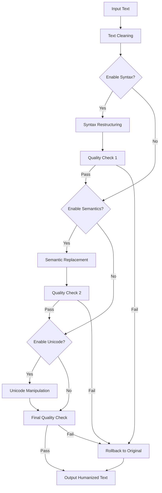
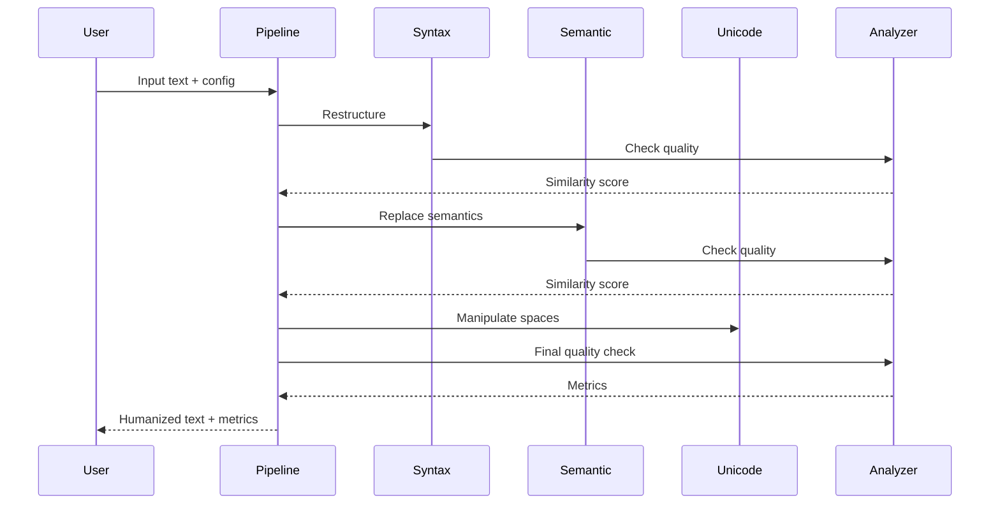

# Architecture Overview

## System Design

The AI Text Humanizer uses a multi-stage pipeline architecture with quality gates and rollback mechanisms.



## Core Components

### 1. Space Manipulator (`src/core/space_manipulator.py`)

**Purpose**: Replace standard spaces with Unicode variants

**Key Features**:
- 9 Unicode space character variants
- Randomized distribution algorithm
- Configurable intensity (0.0-1.0)
- Boundary preservation
- Distribution analysis tools

**Algorithm**:
```python
for each space in text:
    if random() < intensity:
        replace with random Unicode variant
    else:
        keep original space
```

### 2. Syntax Restructurer (`src/core/syntax_restructurer.py`)

**Purpose**: Transform sentence structures while preserving meaning

**Transformations**:
- **Passive → Active**: Uses spaCy dependency parsing to identify passive constructions
- **Clause Reordering**: Moves dependent clauses for variety
- **Nominalization Reversal**: Converts noun phrases to verb forms
- **Sentence Complexity**: Splits long sentences, combines short ones

**Dependencies**: spaCy for dependency parsing and POS tagging

### 3. Semantic Replacer (`src/core/semantic_replacer.py`)

**Purpose**: Replace words and phrases with context-appropriate alternatives

**Features**:
- **Curated Synonym Groups**: Organized by formality level
- **WordNet Integration**: Fallback for broader synonym coverage
- **Discourse Marker Variation**: 40+ transition word alternatives
- **Phrase Substitution**: Common phrase simplification

**Formality Levels**:
- `formal`: Academic/professional writing
- `technical`: Technical documentation
- `casual`: Informal communication

### 4. NLP Parser (`src/nlp/parsers.py`)

**Purpose**: Provide NLP analysis capabilities

**Features**:
- Model caching for performance
- Sentence segmentation
- POS tagging
- Dependency parsing
- Passive voice detection
- Clause identification

**Model**: spaCy `en_core_web_lg` (685MB)

### 5. Quality Analyzers (`src/nlp/analyzers.py`)

**Components**:

#### ReadabilityAnalyzer
- Flesch-Kincaid Grade Level
- Gunning Fog Index
- SMOG Index
- Coleman-Liau Index

#### SemanticSimilarityChecker
- Uses sentence-transformers (`all-MiniLM-L6-v2`)
- Cosine similarity calculation
- Sentence-by-sentence comparison

#### AIDetectionEstimator
- Heuristic-based risk scoring
- Pattern density analysis
- Sentence length variance
- Risk score: 0-100

### 6. Humanization Pipeline (`src/core/pipeline.py`)

**Purpose**: Orchestrate all transformations with quality assurance

**Process Flow**:
1. **Syntax Restructuring** (if enabled)
   - Apply transformations
   - Check semantic similarity
   - Rollback if similarity < threshold
2. **Semantic Replacement** (if enabled)
   - Apply replacements
   - Check semantic similarity
   - Rollback if similarity < threshold
3. **Unicode Manipulation** (if enabled)
   - Apply space replacements
4. **Final Quality Check**
   - Verify semantic similarity ≥ threshold
   - Verify readability change ≤ ±5%
   - Rollback entire pipeline if failed

**Quality Gates**:
- Semantic similarity threshold: 0.85 (default)
- Readability change threshold: ±5%

## Data Flow



## Performance Considerations

### Model Loading
- spaCy model loaded once and cached
- Sentence transformer loaded on-demand
- ~1.5s initial load time

### Processing Speed
- 1000 words: ~1.2-1.5s
- 5000 words: ~4-6s
- Bottleneck: spaCy dependency parsing

### Memory Usage
- spaCy model: ~500MB
- Sentence transformer: ~80MB
- Runtime: ~50-100MB per request

## Extensibility

### Adding New Transformations

1. Create transformer class in `src/core/`
2. Implement transformation method returning `(result, confidence)`
3. Add to pipeline in `pipeline.py`
4. Add configuration parameter

### Adding New Quality Metrics

1. Create analyzer class in `src/nlp/analyzers.py`
2. Implement analysis method
3. Add to `_calculate_quality_metrics()` in pipeline

### Supporting New Languages

1. Download spaCy model for target language
2. Update `NLPParser` to support language parameter
3. Create language-specific synonym groups
4. Adjust discourse markers for language

## Security Considerations

- Input sanitization in web interface
- File upload size limits
- Rate limiting recommended for production
- No persistent storage of user data
- CORS enabled for web API (configure for production)
